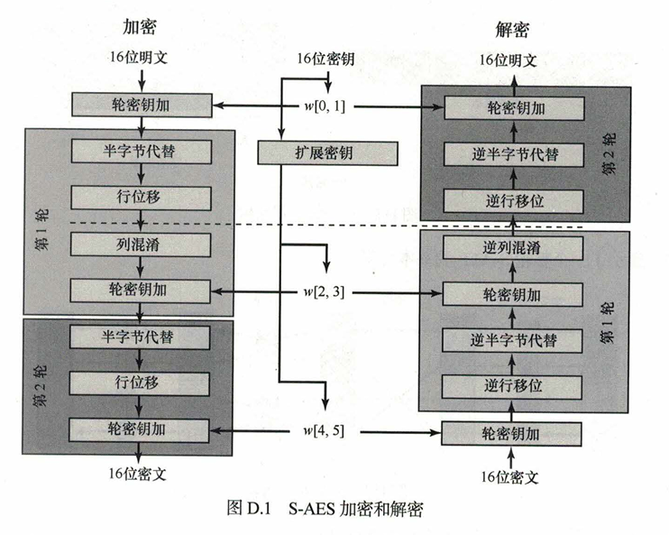
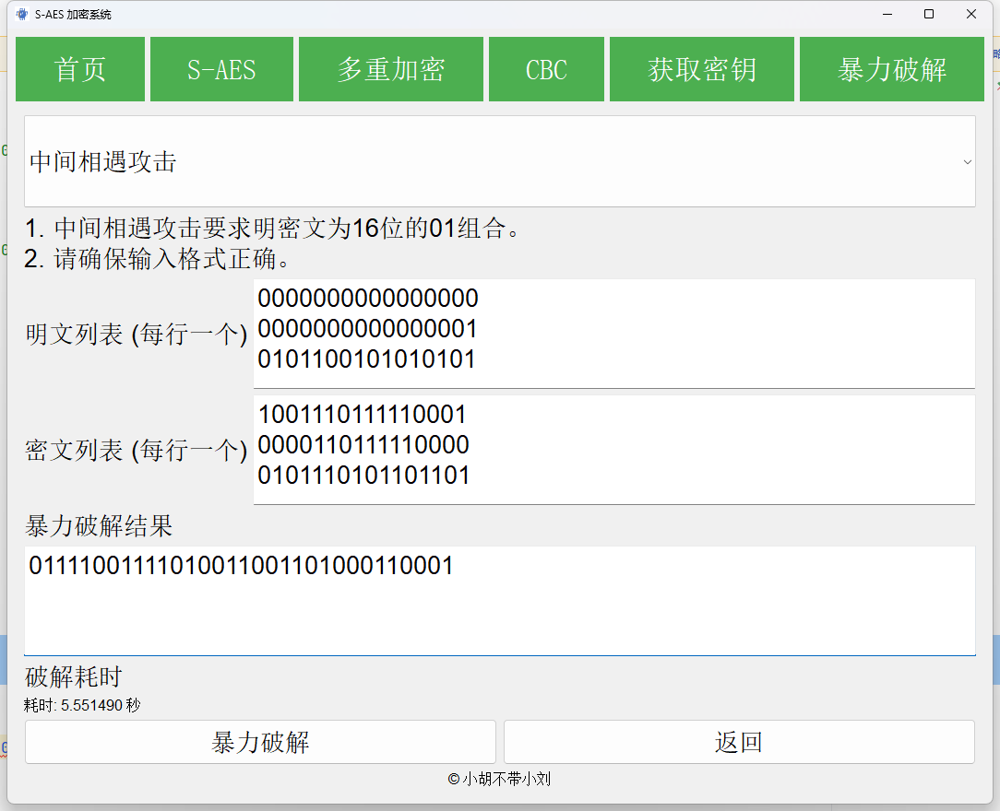
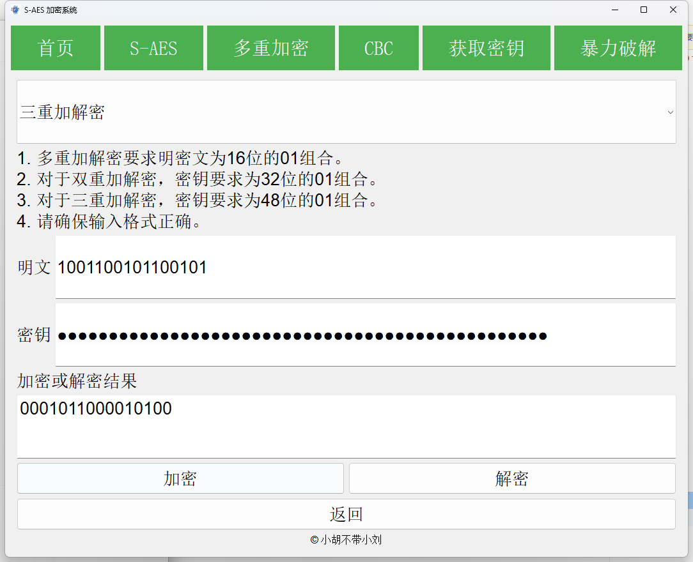
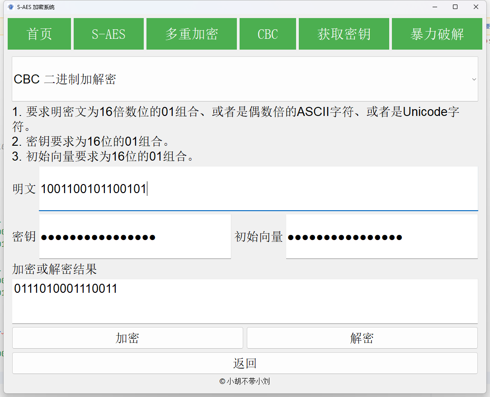

# 开发手册

  S-AES系统是一款专为用户设计的工具，旨在为您提供高效、快速的SimpleAED加密与解密、多重加解密、中间相遇攻击、生成密钥等服务。通过一个直观的应用，即使是小白也可以轻松上手。

## S-AES算法流程

  

## 项目结构

```markdown
├── img                             - 存放代码图片
├── result_img                      - 存放结果图片
├── qtWin.py                        - 界面实现
├── S_AES.py                        - S-AES算法实现
├── requirements.txt   
├── 开发手册.md                         
├── README.md    
└── S-AES.exe   
```

## 主要函数
```python
# 密钥加
def key_plus(input, key):
# 半字节替换
def substitute_half_bytes(input, box):
# 行移位
def row_shift(input):
# 列混淆
def col_confusion(input, box):
# 密钥扩展
def key_expansion(key):
# 加密
def encrypt(input, key):
# 解密
def decrypt(input, key):
# 加密ASCII字符串
def encrypt_ASCII(input, key):
# 解密ASCII字符串
def decrypt_ASCII(encrypted_str, key):
# 双重加密(K1 != K2)
def encrypt_double(input, key):
# 双重解密(K1 != K2)
def decrypt_double(input, key):
# 中间相遇攻击
def middle_attack(inputs, outputs):
# 三重加密
def encrypt_triple(input, key):
# 三重解密
def decrypt_triple(input, key):
# 检查输入类型并进行处理
def preprocess_input(input_data, input_type):
# CBC模式加密
def encrypt_CBC(plaintext, key, iv, input_type):
# CBC模式解密
def decrypt_CBC(ciphertext, key, iv, input_type):
```

## 第1关：基本测试

- 根据S-AES算法编写和调试程序，提供GUI解密支持用户交互。输入可以是16bit的数据和16bit的密钥，输出是16bit的密文。

### 主界面

- 可以选择不同的功能，包括**首页，S-AES加解密，多重加解密，CBC加解密，获取密钥，暴力破解**
  

### 加解密操作

- 密钥采用隐式显示

- 二进制选项
```markdown
plaintext = '1111000000110111'
key = '1001100101100101'
ciphertext = '0110001111110011'
```


### 获取密钥操作

- 使用python的secrets模块获取随机密钥，提供的函数可以获取长度不同的密钥，通过输入的数，获取对应长度的密钥。

```python
# 获取密钥函数
def generate_key(input):
    length = int(input)
    key = secrets.randbits(length)
    key_bin = bin(key).replace('0b', '').zfill(length)
    return key_bin
```

 

## 第2关：交叉测试

- 考虑到是"算法标准"，所有人在编写程序的时候需要使用相同算法流程和转换单元(替换盒、列混淆矩阵等)，以保证算法和程序在异构的系统或平台上都可以正常运行。
- 设有A和B两组位同学(选择相同的密钥K)；则A、B组同学编写的程序对明文P进行加密得到相同的密文C；或者B组同学接收到A组程序加密的密文C，使用B组程序进行解密可得到与A相同的P。

     - **A组**
 
    
    
  
     - **B组**
      
    
    

## 第3关：扩展功能

- 考虑到向实用性扩展，加密算法的数据输入可以是ASII编码字符串(分组为2 Bytes)，对应地输出也可以是ACII字符串(很可能是乱码)。

### 功能实现

- GUI界面提供了二进制加解密、ASCII加解密的按钮，选择可以切换加解密模式，ASCII模式下输出密文为ASCII对应的字符串。
- 通过对按钮的选择切换模式，对于ASCII编码格式，对于每个字符转为二进制单独处理，最后整合获取的结果显示在相应的位置。

```python
        # 使用下拉框实现功能的变换
        self.combo_box1 = QComboBox()
        self.combo_box1.addItem("S-AES 二进制加解密")
        self.combo_box1.addItem("S-AES ASCII 加解密")
        self.combo_box1.setFont(font)
        self.combo_box1.setMinimumHeight(100)
        self.combo_box1.currentIndexChanged.connect(self.change_endecryption_type)
        # 初始设置位二进制加解密
        self.change_endecryption_type(0)
```
```python
# 加密
def encrypt(input, key):
    key_expanded = key_expansion(key)
    result1 = key_plus(input, key_expanded[0])
    result2 = substitute_half_bytes(result1, S_BOX)
    result3 = row_shift(result2)
    result4 = col_confusion(result3, Cfs_BOX)
    result5 = key_plus(result4, key_expanded[1])
    result6 = substitute_half_bytes(result5, S_BOX)
    result7 = row_shift(result6)
    result8 = key_plus(result7, key_expanded[2])
    return result8
```
```python
# 加密ASCII字符串
def encrypt_ASCII(input, key):
    if not all(0 <= ord(c) < 255 for c in input):
        raise ValueError("输入包含非ASCII字符")
    binary_input = string_to_bin(input)
    binary_chunks = [binary_input[i:i + 16] for i in range(0, len(binary_input), 16)]
    encrypted_chunks = []
    for chunk in binary_chunks:
        if len(chunk) != 16:
            raise ValueError("输入必须为偶数个ASCII字符")
        encrypted_chunk = encrypt(chunk, key)
        encrypted_chunks.append(encrypted_chunk)
    encrypted_binary = ''.join(encrypted_chunks)
    encrypted_ascii = bin_to_string(encrypted_binary)
    return encrypted_ascii
```


- 二进制选项
```markdown
plaintext = '1111000000110111'
key = '1001100101100101'
ciphertext = '0110001111110011'
```
   

- ASCII选项
```markdown
plaintext = 'nihao!'
key = '1001100101100101'
ciphertext = 'BçcFgf'
```
   


## 第4关：多重加密
### 3.4.1 双重加密
- 将S-AES算法通过双重加密进行扩展，分组长度仍然是16 bits，但密钥长度为32 bits。
- 采用**先加密再解密**进行加密操作。
```python
# 双重加密(K1 != K2)
def encrypt_double(input, key):
    key1 = key[:16]
    key2 = key[16:]
    midtext = encrypt(input, key1)
    output = decrypt(midtext, key2)
    return output
```
```markdown
plaintext = '1001100101100101'
key = '10100011101100000000011010101011'
ciphertext = '1110100101111101'
```
 

### 3.4.2 中间相遇攻击
- 假设你找到了使用相同密钥的明、密文对(一个或多个)，请尝试使用中间相遇攻击的方法找到正确的密钥Key(K1+K2)。
```python
# 中间相遇攻击
def middle_attack(inputs, outputs):
    start_time = time.time()
    found_keys = []
    possible_keys = None
    for idx in range(len(inputs)):
        input_bin = inputs[idx]
        output_bin = outputs[idx]
        encrypt_dict = {}
        decrypt_dict = {}
        for K1 in range(0x0000, 0xFFFF + 1):
            K1_str = bin(K1)[2:].zfill(16)
            midtext1 = encrypt(input_bin, K1_str)
            encrypt_dict[midtext1] = K1_str
        for K2 in range(0x0000, 0xFFFF + 1):
            K2_str = bin(K2)[2:].zfill(16)
            midtext2 = encrypt(output_bin, K2_str)
            decrypt_dict[midtext2] = K2_str
        current_matches = [(encrypt_dict[m], decrypt_dict[m]) for m in encrypt_dict if m in decrypt_dict]
        if possible_keys is None:
            possible_keys = set(current_matches)
        else:
            possible_keys.intersection_update(current_matches)
    end_time = time.time()
    if possible_keys and len(possible_keys) > 0:
        for K1_str, K2_str in possible_keys:
            key = K1_str + K2_str
            found_keys.append(key)
        print(f"找到 {len(possible_keys)} 组匹配的密钥对:")
    else:
        print("未找到匹配的密钥对")
    elapsed_time = end_time - start_time
    print(f"算法执行时间: {elapsed_time:.6f} 秒")
    return found_keys, elapsed_time
```
```markdown
plaintext = ['0000000000000000', '0000000000000001', '0101100101010101']
key = ['1001110111110001', '0000110111110000', '0101110101101101']
ciphertext = ['01111001111010011001101000110001']
```
 
```markdown
plaintext = ['0000000000000000', '0000000000000001']
key = ['1001110111110001', '0000110111110000']
ciphertext = ['10100111000000101111010111010000',
'00010011001110011100011100000110',
'11101001110011001010011100011110',
'01110101000111111110001110110101'……]
```
 

### 3.4.3 三重加密
- 将S-AES算法通过三重加密进行扩展，使用48bits(K1+K2+K3)的模式进行三重加解密。
- 采用**先加密再解密再加密**进行加密操作。
```python
# 三重加密
def encrypt_triple(input, key):
    key1 = key[:16]
    key2 = key[16:32]
    key3 = key[32:]
    midtext1 = encrypt(input, key1)
    midtext2 = decrypt(midtext1, key2)
    output = encrypt(midtext2, key3)
    return output

```
```markdown
plaintext = '1001100101100101'
key = '101000111011000000000110101010111001100101100101'
ciphertext = '0001011000010100'
```
 


## 第5关：工作模式
- 基于S-AES算法，使用密码分组链(CBC)模式对较长的明文消息进行加密。注意初始向量(16 bits) 的生成，并需要加解密双方共享。
```python
# 初始向量(IV)的生成
def generate_iv():
    return bin(random.randint(0x0000, 0xFFFF))[2:].zfill(16)
```
- 二进制选项
```markdown
plaintext = '1001100101100101'
key = '1010011100111011'
iv = '1011011111100011'
ciphertext = '0111010001110011'
```
 

- ASCII选项
```markdown
plaintext = 'nihao!'
key = '1010011100111011'
iv = '1011011111100011'
ciphertext = '+6Jcp'
```
 

- Unicode
```markdown
plaintext = '小胡不带小刘'
key = '1010011100111011'
iv = '1011011111100011'
ciphertext = '乷Ꝝ맯툄儒�'
```
 


- 在CBC模式下进行加密，并尝试对密文分组进行替换或修改，然后进行解密，请对比篡改密文前后的解密结果。

```markdown
plaintext = 'xiaohubudaixiaoliu'
key = '1010011100111011'
iv = '1011011111100011'
ciphertext = 'x^ÖøÄt^i+×Ç )Yè'
```
 
```markdown
plaintext = 'x^ÖøÄt^i+×Ç )Y?'
key = '1010011100111011'
iv = '1011011111100011'
ciphertext = 'xiaohubudaixiaol'
```
 


## 总结
- 本次作业是实现简单的AES系统，算法本身已经简化了，实现算法较为简单，笔者认为难的部分在于可视化界面的设计，包括页面的设计、页面的跳转、读取输入、报错提
示以及显示结果等等。如果说还可以继续改进的话（指只在S-AES的基础上），理论上可以设计手动输入矩阵的一些细节，或者说改变密钥空间（
从16位拓展为20位），可以增强安全性（但是会存在时间代价）。这就很让日期待后面会学到的非对称加密算法RSA了。


## 特别鸣谢
 - 课程名称：信息安全导论
 - 教学班级：992987-001
 - 任课教师：胡海波
 - 单位：重庆大学大数据与软件学院
 - 小组：小胡不带小刘
 - 成员：刘肖、胡力文
 - 若有任何疑问或建议，请联系开发团队：1065098732@qq.com