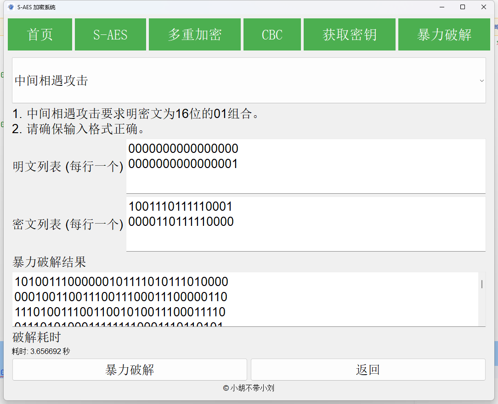
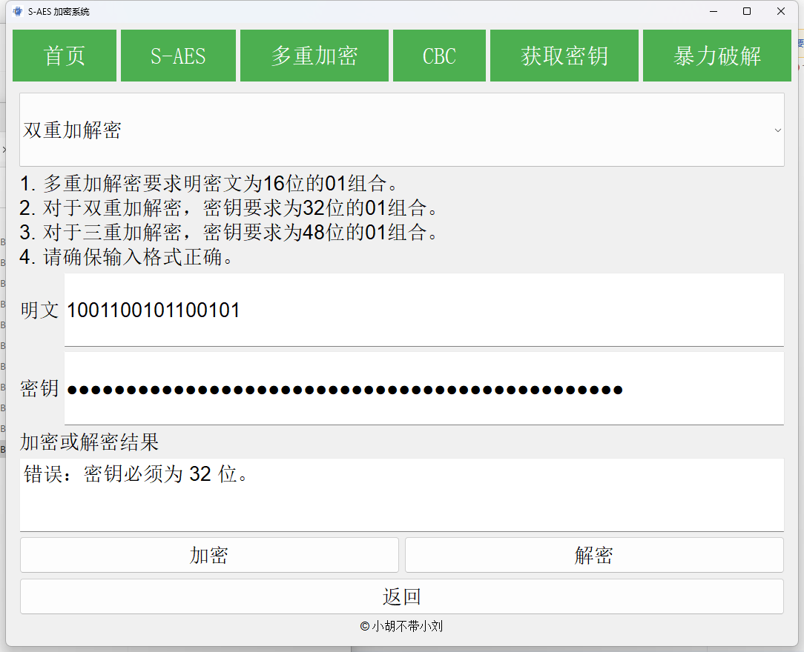

# 用户指南 - S-AES系统

## 1. 系统简介

  S-AES系统是一款专为用户设计的工具，旨在为您提供高效、快速的SimpleAED加密与解密、多重加解密、中间相遇攻击、生成密钥等服务。通过一个直观的应用，即使是小白也可以轻松上手。

## 2. 环境配置

### 2.1 安装Python

请确保您的计算机上已经安装了Python 3.10。您可以通过访问Python的官方网站来下载并安装。

### 2.2 安装依赖

1. 打开命令提示符或终端。
2. 切换到系统的根目录。
3. 输入并执行以下命令来安装必要的依赖包：

```sh
pip install -r requirements.txt -i https://mirrors.tuna.tsinghua.edu.cn/pypi/web/simple
```

## 3. 启动系统

在终端，执行以下命令：

```sh
python qtWin.py
```

可进入系统的主界面。或者直接下载并且双击我们的S-AES.exe。

## 4. 主界面介绍

系统的界面分为几个主要区域：

- **首页**：首页，有S-AES的流程图。
- **S-AES**：用户可以选择需要加密解密的内容类型（16位二进制数或者ASCII字符），并进行相应的加解密操作。
- **多重加密**：用户可以选择需要加密解密的内容类型（双重加密或者三重加密），并进行相应的加解密操作。
- **CBC加密**：用户可以选择需要加密解密的内容类型（16位二进制数、ASCII字符或者是Unicode字符），并进行相应的加解密操作。
- **获取密钥**：如果双方想要确定一个随机密钥，可以使用这个功能尝试获取它；同时也可以获取随机的初始向量。
- **暴力破解**：提供了一种针对双重加密的中间相遇攻击。
  

## 5. 如何使用

### 5.1 16位二进制数加解密

1. 在主界面中，定位到“S-AES”按钮。
2. 默认的是16位二进制数加解密，所以不用更改。
3. 在提供的输入框中，输入您的16位二进制数以及16位密钥。
4. 选择您希望进行的操作：“加密”或“解密”。
5. 在下方，您会看到一个输出框展示结果。


### 5.2 ASCII字符加解密

1. 点击“S-AES 二进制加解密”，定位到“ASCII加解密”选项。
2. 在输入框中，键入您需要加密或解密的ASCII字符以及16位密钥。
3. 选择“加密”或“解密”按钮。
4. 输出结果将会在下方的区域展示。
   

### 5.3 双重加解密

1. 在主界面中，定位到“多重加密”按钮。
2. 默认的是双重加解密，所以不用更改。
3. 在提供的输入框中，输入您的16位二进制数以及32位密钥。
4. 选择您希望进行的操作：“加密”或“解密”。
5. 在下方，您会看到一个输出框展示结果。


### 5.4 三重加解密

1. 点击“双重加解密”，定位到“三重加解密”选项。
2. 在输入框中，键入您需要加密或解密的16位二进制数以及48位密钥。
3. 选择“加密”或“解密”按钮。
4. 输出结果将会在下方的区域展示。
   

### 5.5 CBC二进制加解密

1. 在主界面中，定位到“CBC”按钮。
2. 默认的是CBC二进制加解密，所以不用更改。
3. 在提供的输入框中，输入您的16位二进制数、16位密钥以及16位的初始向量。
4. 选择您希望进行的操作：“加密”或“解密”。
5. 在下方，您会看到一个输出框展示结果。


### 5.6 CBC ASCII加解密

1. 点击“CBC二进制加解密”，定位到“CBC ASCII加解密”选项。
2. 在提供的输入框中，输入您的偶数位ASCII字符、16位密钥以及16位的初始向量。
3. 选择“加密”或“解密”按钮。
4. 输出结果将会在下方的区域展示。
   

### 5.7 CBC Unicode加解密

1. 点击“CBC二进制加解密”，定位到“CBC Unicode加解密”选项。
2. 在提供的输入框中，输入您的Unicode字符、16位密钥以及16位的初始向量。
3. 选择“加密”或“解密”按钮。
4. 输出结果将会在下方的区域展示。
   

### 5.8 获取密钥

1. 如果双方没有确定密钥，可以转到“获取密钥”区域。
2. 输入想要生成的密钥位数，点击“生成密钥”就可以生成随机的密钥。
3. 初始向量（IV）也可以生成（固定16位）。
4. 务必保存好密钥和初始向量。
 


### 5.9 中间相遇攻击

1. 我们还提供了双重加密的中间相遇攻击，转到“暴力破解”区域。
2. 输入16位的明文和密文。
3. 点击“暴力破解”。
4. 系统将遍历所有可能的密钥组合，在找到正确的密钥后在下方输出，并且输出破解时间。
    
    


## 6. 开发手册

对于高级用户或希望自动化一些过程的用户，我们提供了开发手册。详情请参考随附的“[开发手册.md](开发手册.md)”文件。

## 7. 故障排查

### 7.1 无法启动系统

- 确保Python版本为3.10。
- 确保所有依赖都已经正确安装。
- S-AES.exe文件是打包好的应用程序，无须配置环境，如打不开请及时联系开发人员。

### 7.2 加解密出错

- 请确保输入格式正确。
#### 错误实例
 
 
 
 
 
 
 
 

### 7.3 暴力破解出错
- 二进制中间相遇攻击要求明密文为16位的01组合。
- 请确保输入格式正确。
- 如果问题持续，请联系我们的技术支持。