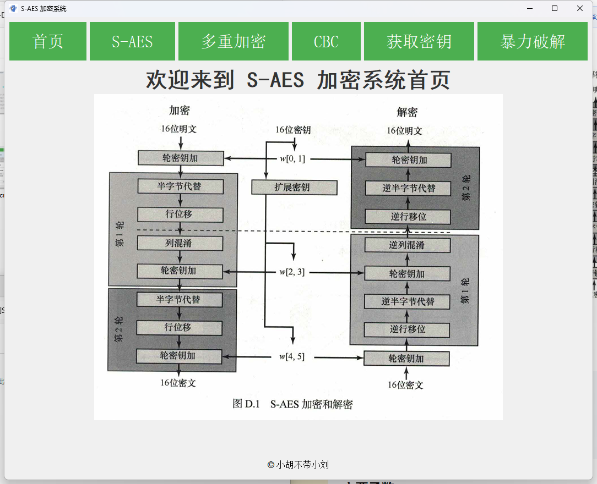

# 鐢ㄦ埛鎸囧崡 - S-DES绯荤粺

## 1. 绯荤粺绠€浠�

S-DES绯荤粺鏄竴娆句笓涓虹敤鎴疯璁＄殑宸ュ叿锛屾棬鍦ㄤ负鎮ㄦ彁渚涢珮鏁堛€佸揩閫熺殑8-bit浜岃繘鍒舵暟銆丄SCII瀛楃鍜孶nicode瀛楃鐨勫姞瀵嗕笌瑙ｅ瘑鏈嶅姟銆傞€氳繃涓€涓洿瑙傜殑搴旂敤锛屽嵆浣挎槸灏忕櫧涔熷彲浠ヨ交鏉句笂鎵嬨€�

## 2. 鐜閰嶇疆

### 2.1 瀹夎Python

璇风‘淇濇偍鐨勮绠楁満涓婂凡缁忓畨瑁呬簡Python 3.10銆傛偍鍙互閫氳繃璁块棶Python鐨勫畼鏂圭綉绔欐潵涓嬭浇骞跺畨瑁呫€�

### 2.2 瀹夎渚濊禆

1. 鎵撳紑鍛戒护鎻愮ず绗︽垨缁堢銆�
2. 鍒囨崲鍒扮郴缁熺殑鏍圭洰褰曘€�
3. 杈撳叆骞舵墽琛屼互涓嬪懡浠ゆ潵瀹夎蹇呰鐨勪緷璧栧寘锛�

```sh
pip install -r requirements.txt -i https://mirrors.tuna.tsinghua.edu.cn/pypi/web/simple
```

## 3. 鍚姩绯荤粺

鍦ㄧ粓绔紝鎵ц浠ヤ笅鍛戒护锛�

```sh
python qtWin.py
```

鍙繘鍏ョ郴缁熺殑涓荤晫闈€€傛垨鑰呯洿鎺ヤ笅杞藉苟涓斿弻鍑绘垜浠殑S-DES.exe銆�

## 4. 涓荤晫闈粙缁�

绯荤粺鐨勭晫闈㈠垎涓哄嚑涓富瑕佸尯鍩燂細

- **棣栭〉**锛氶椤碉紝鏈塖-DES鐨勬祦绋嬪浘銆�
- **鍔犲瘑瑙ｅ瘑鍖�**锛氱敤鎴峰彲浠ラ€夋嫨闇€瑕佸姞瀵嗚В瀵嗙殑鍐呭绫诲瀷锛�8浣嶄簩杩涘埗鏁般€丄SCII瀛楃鎴朥nicode瀛楃锛夛紝骞惰繘琛岀浉搴旂殑鍔犺В瀵嗘搷浣溿€�
- **瀵嗛挜鐢熸垚**锛氬鏋滃弻鏂规兂瑕佺‘瀹氫竴涓殢鏈哄瘑閽ワ紝鍙互浣跨敤杩欎釜鍔熻兘灏濊瘯鑾峰彇瀹冦€�
- **鏆村姏鐮磋В**锛氬鏋滄偍蹇樿浜嗗瘑閽ワ紝鍙互浣跨敤杩欎釜鍔熻兘灏濊瘯鑾峰彇瀹冦€�
  

## 5. 濡備綍浣跨敤

### 5.1 8浣嶄簩杩涘埗鏁板姞瑙ｅ瘑

1. 鍦ㄤ富鐣岄潰涓紝瀹氫綅鍒扳€滃姞瑙ｅ瘑鈥濇寜閽€�
2. 榛樿鐨勬槸8浣嶄簩杩涘埗鏁板姞瑙ｅ瘑锛屾墍浠ヤ笉鐢ㄦ洿鏀广€�
3. 鍦ㄦ彁渚涚殑杈撳叆妗嗕腑锛岃緭鍏ユ偍鐨�8浣嶄簩杩涘埗鏁般€�
4. 閫夋嫨鎮ㄥ笇鏈涜繘琛岀殑鎿嶄綔锛氣€滃姞瀵嗏€濇垨鈥滆В瀵嗏€濄€�
5. 鍦ㄤ笅鏂癸紝鎮ㄤ細鐪嬪埌涓€涓緭鍑烘灞曠ず缁撴灉銆�


### 5.2 ASCII瀛楃鍔犺В瀵�

1. 鐐瑰嚮鈥滀簩杩涘埗鍔犺В瀵嗛€夐」鈥濓紝瀹氫綅鍒扳€淎SCII鍔犺В瀵嗏€濋€夐」銆�
2. 鍦ㄨ緭鍏ユ涓紝閿叆鎮ㄩ渶瑕佸姞瀵嗘垨瑙ｅ瘑鐨凙SCII瀛楃銆�
3. 閫夋嫨鈥滃姞瀵嗏€濇垨鈥滆В瀵嗏€濇寜閽€�
4. 杈撳嚭缁撴灉灏嗕細鍦ㄤ笅鏂圭殑鍖哄煙灞曠ず銆�
   


### 5.3 Unicode瀛楃鍔犺В瀵�

1. 鐐瑰嚮鈥滀簩杩涘埗鍔犺В瀵嗛€夐」鈥濓紝瀹氫綅鍒扳€淯nicode鍔犺В瀵嗏€濋€夐」銆�
2. 鍦ㄨ緭鍏ユ涓紝閿叆鎮ㄩ渶瑕佸姞瀵嗘垨瑙ｅ瘑鐨刄nicode瀛楃銆�
3. 閫夋嫨鈥滃姞瀵嗏€濇垨鈥滆В瀵嗏€濇寜閽€�
4. 杈撳嚭缁撴灉灏嗕細鍦ㄤ笅鏂圭殑鍖哄煙灞曠ず銆�
   


### 5.4 鑾峰彇瀵嗛挜

1. 濡傛灉鍙屾柟娌℃湁纭畾瀵嗛挜锛屽彲浠ヨ浆鍒扳€滆幏鍙栧瘑閽モ€濆尯鍩熴€�
2. 鐐瑰嚮鈥滅敓鎴愬瘑閽モ€濆氨鍙互鐢熸垚闅忔満鐨勫瘑閽ャ€�
3. 鍔″繀淇濆瓨濂藉瘑閽ャ€�
 


### 5.5 鏆村姏鐮磋В

1. 濡傛灉鎮ㄩ仐澶变簡瀵嗛挜锛岃浆鍒扳€滄毚鍔涚牬瑙ｂ€濆尯鍩熴€�
2. 杈撳叆浜岃繘鍒舵暟銆丄SCII瀛楃鎴栬€呮槸Unicode瀛楃鐨勬槑鏂囧拰瀵嗘枃銆�
3. 鐐瑰嚮鈥滃紑濮嬬牬瑙ｂ€濄€�
4. 绯荤粺灏嗛亶鍘嗘墍鏈夊彲鑳界殑瀵嗛挜缁勫悎锛屽湪鎵惧埌姝ｇ‘鐨勫瘑閽ュ悗鍦ㄤ笅鏂硅緭鍑猴紝骞朵笖杈撳嚭鐮磋В鏃堕棿銆�
    


## 6. 寮€鍙戞墜鍐�

瀵逛簬楂樼骇鐢ㄦ埛鎴栧笇鏈涜嚜鍔ㄥ寲涓€浜涜繃绋嬬殑鐢ㄦ埛锛屾垜浠彁渚涗簡寮€鍙戞墜鍐屻€傝鎯呰鍙傝€冮殢闄勭殑鈥淸寮€鍙戞墜鍐�.md](寮€鍙戞墜鍐�.md)鈥濇枃浠躲€�

## 7. 鏁呴殰鎺掓煡

### 7.1 鏃犳硶鍚姩绯荤粺

- 纭繚Python鐗堟湰涓�3.10銆�
- 纭繚鎵€鏈変緷璧栭兘宸茬粡姝ｇ‘瀹夎銆�
- S-DES.exe鏂囦欢鏄墦鍖呭ソ鐨勫簲鐢ㄧ▼搴忥紝鏃犻』閰嶇疆鐜锛屽鎵撲笉寮€璇峰強鏃惰仈绯诲紑鍙戜汉鍛樸€�

### 7.2 鍔犺В瀵嗗嚭閿�

- 浜岃繘鍒跺姞瑙ｅ瘑瑕佹眰鏄庡瘑鏂囦负8浣嶇殑01缁勫悎銆�
- 瀵嗛挜瑕佹眰涓�10浣嶇殑01缁勫悎銆�
- 璇风‘淇濊緭鍏ユ牸寮忔纭€�
#### 閿欒瀹炰緥
 
 
 
 
 

### 7.3 鏆村姏鐮磋В鍑洪敊
- 浜岃繘鍒舵毚鍔涚牬瑙ｈ姹傛槑瀵嗘枃涓�8浣嶇殑01缁勫悎銆�
- ASCII鍜孶nicode鏆村姏鐮磋В瑕佹眰鏄庡瘑鏂囬暱搴︿竴鑷淬€�
- 璇风‘淇濊緭鍏ユ牸寮忔纭€�
- 濡傛灉闂鎸佺画锛岃鑱旂郴鎴戜滑鐨勬妧鏈敮鎸併€�
#### 閿欒瀹炰緥
 
 
